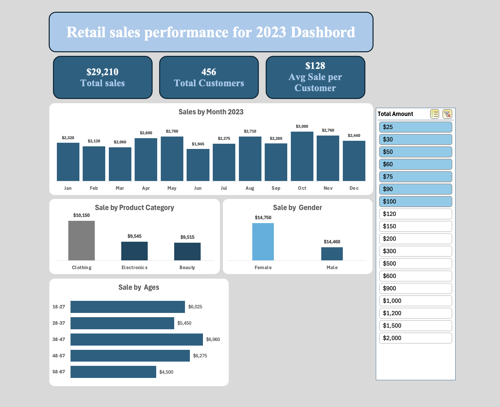

# Retail-Sales-Analysis-Excel-Dashboard

📊 Retail Sales Analysis & Customer Segmentation (Excel)
📌 Overview
This project analyzes retail sales data using Excel to understand customer behavior, sales performance, and revenue distribution.
Customers are segmented into spending groups to identify key business insights.

📊 Dataset
* Source: Retail Sales Dataset - Kaggle
* Note: Synthetic dataset for learning purposes

📊 Customer Segments
* Low-value: < $100
* Mid-value: $100 – $900
* High-value: > $1000

🔍 Key Insights
🟢 Low-Value Customers (< $100)
* Largest number of customers but lowest revenue ($29K)
* Avg spend: $128/customer
* Prefer Clothing
* Strong in age group 38–47
👉 Focus: Increase spending using bundles & upselling

🔵 Mid-Value Customers ($100–$900)
* Generate $150K revenue
* Avg spend: $670/customer
* Mix of Clothing & Electronics
* Strong in 48–57 age group
👉 Focus: Convert to high-value customers

🔴 High-Value Customers (> $1000)
* Small segment (201 customers) but highest revenue ($285K)
* Avg spend: $2,825/customer
* Prefer Electronics
* Dominated by 18–27 age group
👉 Focus: Retention & loyalty programs

📊 Overall Insights
* Total revenue: $454K from 998 customers
* Revenue is concentrated in high-value customers
* Peak sales: May, October, December
* Female customers slightly contribute more

🚀 Business Recommendations
* Focus on retaining high-value customers (loyalty programs)
* Convert mid-value customers through targeted offers
* Promote Electronics for high spenders
* Improve sales during low months (e.g., September)
* Target age group 18–27 with marketing campaigns
* Increase low-value spending via bundles

⚠️ Limitations
* Dataset is synthetic (not real-world)
* No data on marketing campaigns or external factors
* No customer lifetime tracking (CLV)
* Limited demographic features
* No seasonal/holiday indicators

🗂️ Raw Data Preview
Below is a sample of the original dataset used for analysis:
Retail-Sales-Analysis-Excel-Dashboard/images/raw-data.png

📈 Dashboard

🛠️ Tools
Excel (Pivot Tables, Data Cleaning, Visualization)
